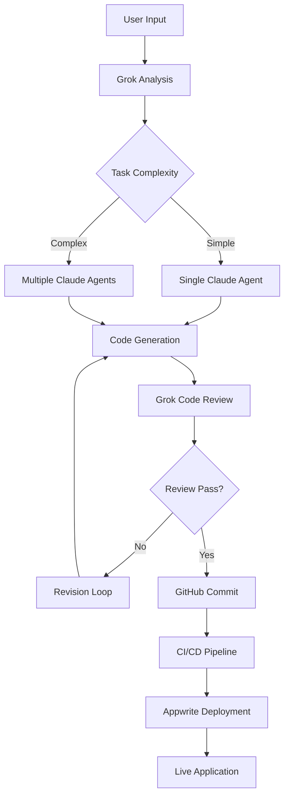

# AI Development Orchestrator - System Design

## Executive Summary
A comprehensive console application that orchestrates AI-driven development through Grok (Lead Dev) and Claude Code agents (Junior Devs), with automated GitHub deployment and Appwrite infrastructure management.

## System Architecture

### High-Level Architecture
```
┌─────────────────────────────────────────────────────────────┐
│                     Console App (Next.js)                    │
│                   Project: 68a4e3da0022f3e129d0             │
│                    Site: 68a4ed30000cba9224d2               │
├─────────────────────────────────────────────────────────────┤
│                     User Interface Layer                      │
│  ┌──────────────┐  ┌──────────────┐  ┌──────────────┐      │
│  │ Task Input   │  │ Progress View│  │ Results View │      │
│  └──────────────┘  └──────────────┘  └──────────────┘      │
├─────────────────────────────────────────────────────────────┤
│                   Orchestration Engine                       │
│  ┌──────────────────────────────────────────────────┐      │
│  │            Task Queue & State Manager             │      │
│  └──────────────────────────────────────────────────┘      │
├─────────────────────────────────────────────────────────────┤
│                      AI Layer                                │
│  ┌────────────────┐        ┌─────────────────────┐         │
│  │   Grok API     │◄──────►│  Claude Code APIs   │         │
│  │  (Lead Dev)    │        │   (Junior Devs)     │         │
│  └────────────────┘        └─────────────────────┘         │
├─────────────────────────────────────────────────────────────┤
│                   Integration Layer                          │
│  ┌──────────┐  ┌──────────┐  ┌──────────────────┐         │
│  │  GitHub  │  │ Appwrite │  │ Deployment API   │         │
│  │   API    │  │   API    │  │   (Sites/Fns)    │         │
│  └──────────┘  └──────────┘  └──────────────────┘         │
└─────────────────────────────────────────────────────────────┘
```

## Core Components

### 1. Console Application (Frontend)
```typescript
interface ConsoleApp {
  // Main components
  TaskInputPanel: {
    projectDescription: string;
    requirements: string[];
    targetPlatform: 'web' | 'mobile' | 'api' | 'fullstack';
    constraints: string[];
  };
  
  ProgressMonitor: {
    currentTask: Task;
    aiAgents: AgentStatus[];
    completedSteps: Step[];
    errors: Error[];
  };
  
  ResultsViewer: {
    generatedCode: CodeArtifact[];
    deploymentStatus: DeploymentInfo;
    documentation: string;
    testResults: TestResult[];
  };
}
```

### 2. Orchestration Engine
```typescript
interface OrchestrationEngine {
  taskQueue: Queue<DevelopmentTask>;
  stateManager: StateManager;
  
  // Core methods
  submitTask(task: DevelopmentTask): Promise<TaskId>;
  delegateToGrok(task: Task): Promise<GrokResponse>;
  assignToClaudeAgents(subtasks: Subtask[]): Promise<AgentResults>;
  monitorProgress(): Observable<ProgressUpdate>;
  handleFailures(error: Error): Promise<RecoveryStrategy>;
}
```

### 3. AI Integration Layer

#### Grok API Integration (Lead Developer)
```typescript
interface GrokIntegration {
  endpoint: 'https://api.x.ai/v1/completions';
  
  async analyzeRequirements(input: string): Promise<ProjectPlan> {
    // Breaks down user requirements into actionable tasks
    // Returns structured project plan with subtasks
  }
  
  async delegateTasks(plan: ProjectPlan): Promise<TaskAssignments> {
    // Assigns tasks to appropriate Claude agents
    // Returns assignments with priority and dependencies
  }
  
  async reviewCode(artifacts: CodeArtifact[]): Promise<ReviewResult> {
    // Reviews code from Claude agents
    // Ensures quality and consistency
  }
}
```

#### Claude Code Agents (Junior Developers)
```typescript
interface ClaudeAgentPool {
  agents: ClaudeAgent[];
  
  interface ClaudeAgent {
    id: string;
    specialization: 'frontend' | 'backend' | 'database' | 'testing' | 'devops';
    status: 'idle' | 'working' | 'blocked';
    
    async executeTask(task: Subtask): Promise<CodeArtifact> {
      // Executes assigned development task
      // Returns generated code and documentation
    }
  }
  
  async assignTask(task: Subtask): Promise<ClaudeAgent> {
    // Finds available agent with matching specialization
    // Returns assigned agent
  }
}
```

### 4. GitHub Integration
```typescript
interface GitHubIntegration {
  async createRepository(name: string): Promise<Repository>;
  async createBranch(repo: Repository, name: string): Promise<Branch>;
  async commitCode(artifacts: CodeArtifact[]): Promise<Commit>;
  async createPullRequest(branch: Branch): Promise<PullRequest>;
  async mergeToMain(pr: PullRequest): Promise<MergeResult>;
  async triggerWorkflow(workflow: string): Promise<WorkflowRun>;
}
```

### 5. Appwrite Infrastructure Manager
```typescript
interface AppwriteManager {
  projectId: '68a4e3da0022f3e129d0';
  apiKey: string; // Secured API key
  
  // Database setup
  async createDatabase(schema: DatabaseSchema): Promise<Database>;
  async createCollections(collections: Collection[]): Promise<void>;
  async setupIndexes(indexes: Index[]): Promise<void>;
  
  // Functions deployment
  async deployFunction(code: string, runtime: Runtime): Promise<Function>;
  async configureTriggers(triggers: Trigger[]): Promise<void>;
  
  // Sites deployment
  async deploySite(buildArtifacts: BuildArtifact[]): Promise<Site>;
  async configureDomain(domain: string): Promise<void>;
}
```

## Database Schema

### Tasks Collection
```json
{
  "taskId": "string",
  "userId": "string",
  "projectName": "string",
  "requirements": "object",
  "status": "pending|processing|completed|failed",
  "grokAnalysis": "object",
  "claudeAssignments": "array",
  "githubRepo": "string",
  "deploymentInfo": "object",
  "createdAt": "datetime",
  "updatedAt": "datetime"
}
```

### Agent Activities Collection
```json
{
  "activityId": "string",
  "taskId": "string",
  "agentId": "string",
  "agentType": "grok|claude",
  "action": "string",
  "input": "object",
  "output": "object",
  "duration": "number",
  "status": "success|failure",
  "timestamp": "datetime"
}
```

### Deployments Collection
```json
{
  "deploymentId": "string",
  "taskId": "string",
  "type": "site|function|database",
  "appwriteProjectId": "string",
  "githubRepo": "string",
  "buildArtifacts": "array",
  "status": "pending|building|deployed|failed",
  "url": "string",
  "logs": "array",
  "createdAt": "datetime"
}
```

## Workflow Orchestration

### Main Development Flow


## API Specifications

### Task Submission API
```typescript
POST /api/tasks/submit
{
  "project": {
    "name": "string",
    "description": "string",
    "type": "web|mobile|api|fullstack",
    "requirements": ["string"],
    "constraints": ["string"]
  },
  "deployment": {
    "target": "appwrite",
    "autoSetup": boolean,
    "database": boolean,
    "functions": boolean
  }
}

Response: {
  "taskId": "string",
  "estimatedTime": "number",
  "assignedAgents": ["string"]
}
```

### Progress Monitoring WebSocket
```typescript
WS /api/tasks/{taskId}/progress

Messages:
{
  "type": "status|log|error|completion",
  "agent": "grok|claude-{id}",
  "message": "string",
  "progress": 0-100,
  "artifacts": ["string"],
  "timestamp": "datetime"
}
```

## Security Considerations

### API Key Management
```typescript
class SecureKeyManager {
  private encryptedKeys = {
    grok: process.env.GROK_API_KEY_ENCRYPTED,
    appwrite: process.env.APPWRITE_API_KEY_ENCRYPTED,
    github: process.env.GITHUB_TOKEN_ENCRYPTED
  };
  
  async getKey(service: string): Promise<string> {
    // Decrypt key at runtime
    // Never expose in client code
    // Rotate keys regularly
  }
}
```

### Access Control
- User authentication via Appwrite Auth
- Role-based access (admin, developer, viewer)
- API rate limiting per user
- Audit logging for all operations

## Implementation Phases

### Phase 1: Core Infrastructure (Week 1)
- [ ] Setup Next.js console app
- [ ] Configure Appwrite project
- [ ] Implement basic UI components
- [ ] Setup database schema

### Phase 2: AI Integration (Week 2)
- [ ] Integrate Grok API
- [ ] Setup Claude Code agent pool
- [ ] Implement task delegation logic
- [ ] Add progress monitoring

### Phase 3: GitHub Integration (Week 3)
- [ ] GitHub API integration
- [ ] Automated repository creation
- [ ] CI/CD workflow setup
- [ ] Pull request automation

### Phase 4: Deployment Automation (Week 4)
- [ ] Appwrite Sites deployment
- [ ] Functions deployment
- [ ] Database auto-setup
- [ ] Domain configuration

### Phase 5: Testing & Optimization (Week 5)
- [ ] End-to-end testing
- [ ] Performance optimization
- [ ] Error handling improvements
- [ ] Documentation

## Technology Stack

- **Frontend**: Next.js 15, React 19, Tailwind CSS
- **Backend**: Appwrite Functions (Node.js)
- **AI Services**: Grok API, Claude Code API
- **Database**: Appwrite Database
- **Deployment**: Appwrite Sites, GitHub Actions
- **Monitoring**: Custom WebSocket implementation
- **Security**: JWT tokens, encrypted API keys

## Performance Targets

- Task submission: < 500ms response time
- AI agent response: < 10s for simple tasks
- Code generation: < 30s for standard components
- Deployment: < 5 minutes end-to-end
- UI updates: Real-time via WebSocket

## Monitoring & Observability

- Real-time agent status dashboard
- Task execution timeline
- Error tracking and alerting
- Resource usage metrics
- Success rate analytics

## Cost Optimization

- Efficient AI token usage
- Caching of common patterns
- Batch processing for similar tasks
- Auto-scaling based on demand
- Resource cleanup after completion

---

**Next Steps:**
1. Review and approve design
2. Set up development environment
3. Begin Phase 1 implementation
4. Create API documentation
5. Setup monitoring infrastructure