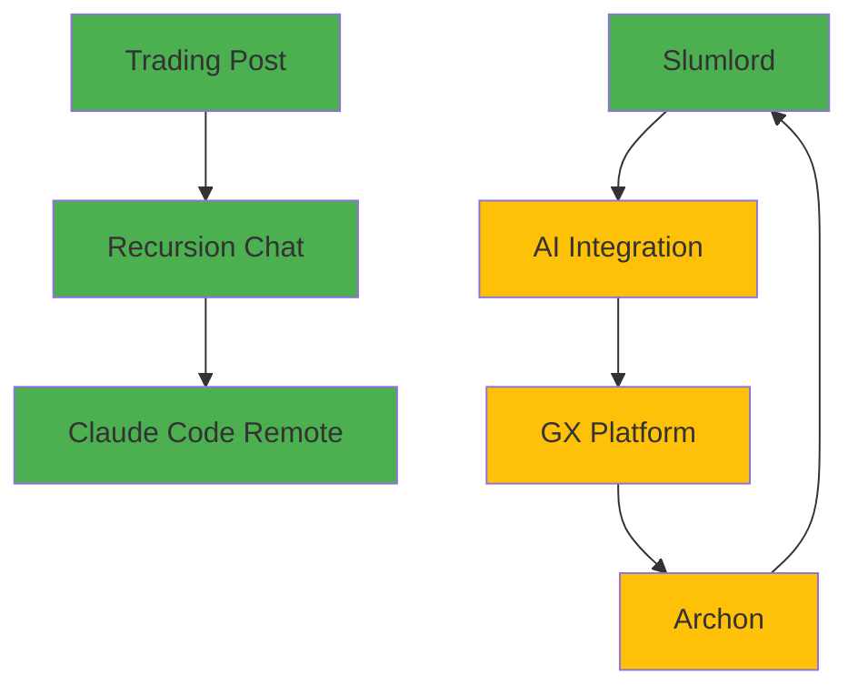

# 📚 SuperClaude Project Portfolio Index
*Generated: 2025-08-23 | Version: 4.0.8*

## 🎯 Quick Navigation

- [Active Projects](#active-projects) (7)
- [Deployment Infrastructure](#deployment-infrastructure)
- [API Services](#api-services)
- [Framework Integrations](#framework-integrations)
- [CI/CD Pipelines](#cicd-pipelines)
- [Knowledge Base](#knowledge-base)

---

## 🚀 Active Projects

### 1. Recursion Chat
**Status:** 🟢 Active | **Version:** 1.0.0 | **Stack:** React + Appwrite + Node.js  
**URL:** https://chat.recursionsystems.com  
**Repository:** [zrottmann/recursion-chat-app](https://github.com/zrottmann/recursion-chat-app)

#### Key Features
- Real-time messaging with WebSocket support
- Google OAuth authentication
- Room-based chat architecture
- Design persistence system

#### Documentation
- [README](active-projects/recursion-chat/README.md)
- [CLAUDE.md](active-projects/recursion-chat/CLAUDE.md) - Critical bug fixes & deployment guide
- [Package Config](active-projects/recursion-chat/package.json)

#### API Endpoints
```javascript
POST   /api/auth/login
POST   /api/auth/logout
GET    /api/rooms
POST   /api/rooms/create
POST   /api/messages/send
GET    /api/messages/:roomId
```

#### Cross-References
- **Authentication:** Shared OAuth system with [Trading Post](#2-trading-post)
- **Deployment:** Uses same Appwrite Sites infrastructure
- **Integration:** Chat API consumed by [Claude Code Remote](#7-claude-code-remote)

---

### 2. Trading Post
**Status:** 🟢 Active | **Version:** 1.0.8 | **Stack:** React + Vite + Python/SQLite  
**URL:** https://tradingpost.appwrite.network  
**Repository:** [zrottmann/tradingpost](https://github.com/zrottmann/tradingpost)

#### Key Features
- Marketplace platform with item listings
- Silent OAuth implementation
- Mobile-responsive design
- Real-time trading system

#### Documentation
- [README](active-projects/trading-post/README.md)
- [Package Config](active-projects/trading-post/package.json)
- [Appwrite Config](active-projects/trading-post/appwrite.json)

#### API Endpoints
```javascript
GET    /api/items
POST   /api/items/create
PUT    /api/items/:id
DELETE /api/items/:id
POST   /api/trades/initiate
POST   /api/trades/accept
```

#### Cross-References
- **Authentication:** OAuth provider for other projects
- **Database:** Schema patterns used in [Recursion Chat](#1-recursion-chat)
- **Frontend:** UI components shared with [Slumlord](#3-slumlord)

---

### 3. Slumlord RPG
**Status:** 🟢 Active | **Version:** 1.0.1 | **Stack:** RPGJS + Appwrite Functions  
**URL:** https://slumlord.appwrite.network  
**Repository:** [zrottmann/slumlord](https://github.com/zrottmann/slumlord)

#### Key Features
- Multiplayer RPG with real-time combat
- Shard-based server architecture
- Mobile support with React Native
- Entity rendering system

#### Documentation
- [README](active-projects/slumlord/README.md)
- [Appwrite Config](active-projects/slumlord/appwrite.json)
- [Mobile App](active-projects/slumlord/mobile/rn-standard/)

#### API Endpoints
```javascript
POST   /api/player/create
POST   /api/player/move
POST   /api/combat/attack
GET    /api/world/entities
POST   /api/shard/join
```

#### Cross-References
- **Functions:** Shard manager integrates with [Archon](#4-archon)
- **Mobile:** React Native patterns shared with Trading Post mobile
- **AI Integration:** Connected to [Slumlord AI Integration](#6-slumlord-ai-integration)

---

### 4. Archon System
**Status:** 🟡 Development | **Stack:** Appwrite Functions + Knowledge Engine  
**Repository:** Local only

#### Key Features
- System architecture orchestration
- Knowledge engine integration
- Multi-function coordination
- Document processing pipeline

#### Documentation
- [README](active-projects/archon/README.md)
- [Appwrite Config](active-projects/archon/appwrite.json)
- [Functions](active-projects/archon/functions/)

#### Cross-References
- **Integration:** Orchestrates [GX Multi-Agent Platform](#5-gx-multi-agent-platform)
- **Functions:** Provides backend for Slumlord sharding
- **Knowledge:** Powers documentation for all projects

---

### 5. GX Multi-Agent Platform
**Status:** 🟡 Development | **Stack:** Multi-agent orchestration  
**Repository:** Local only

#### Key Features
- Agent swarm coordination
- Task delegation system
- Performance optimization
- Security enforcement

#### Documentation
- [README](active-projects/gx-multi-agent-platform/README.md)
- [Package Config](active-projects/gx-multi-agent-platform/package.json)

#### Cross-References
- **Orchestration:** Managed by [Archon](#4-archon)
- **Integration:** Provides AI capabilities to all projects
- **Security:** Implements auth patterns from Trading Post

---

### 6. Slumlord AI Integration
**Status:** 🟡 Development | **Stack:** AI + Game Integration  
**Repository:** Local only

#### Key Features
- NPC AI behavior system
- Dynamic quest generation
- Player behavior analysis
- Combat AI optimization

#### Documentation
- [README](active-projects/slumlord-ai-integration/README.md)
- [Package Config](active-projects/slumlord-ai-integration/package.json)

#### Cross-References
- **Game:** Extends [Slumlord RPG](#3-slumlord)
- **AI Platform:** Uses [GX Multi-Agent Platform](#5-gx-multi-agent-platform)

---

### 7. Claude Code Remote
**Status:** 🟢 Active | **Stack:** Node.js + Express  
**URL:** https://remote.appwrite.network  
**Repository:** [zrottmann/Claude-Code-Remote](https://github.com/zrottmann/Claude-Code-Remote)

#### Key Features
- Remote control interface
- Chat integration API
- Mobile-friendly UI
- Real-time command execution

#### Documentation
- [README](active-projects/Claude-Code-Remote/README.md)
- [Appwrite Config](active-projects/Claude-Code-Remote/appwrite.json)
- [CI/CD](.github/workflows/)

#### Cross-References
- **Chat Integration:** Consumes [Recursion Chat](#1-recursion-chat) API
- **Mobile UI:** Shares components with Trading Post

---

## 🏗️ Deployment Infrastructure

### Appwrite Sites
All projects deploy to Appwrite Sites with auto-deployment:

| Project | Site ID | Endpoint | Status |
|---------|---------|----------|--------|
| Recursion Chat | 689cb6a9003b47a75929 | chat.recursionsystems.com | 🟢 Live |
| Trading Post | 689cb415001a367e69f8 | tradingpost.appwrite.network | 🟢 Live |
| Slumlord | slumlord | slumlord.appwrite.network | 🟢 Live |
| Claude Remote | remote | remote.appwrite.network | 🟢 Live |

### GitHub Actions Workflows
- **Auto-deploy:** Push to main → Build → Deploy to Appwrite
- **Quick Fix:** Rapid deployment with validation bypass
- **CI/CD Pipeline:** Full test suite before deployment

---

## 🔌 API Services

### Authentication Services
```javascript
// Shared authentication service
export const authService = {
  providers: ['google', 'github', 'email'],
  endpoints: {
    login: '/api/auth/login',
    logout: '/api/auth/logout',
    refresh: '/api/auth/refresh',
    oauth: '/api/auth/oauth/:provider'
  }
};
```

### Real-time Services
```javascript
// WebSocket connections
export const realtimeService = {
  chat: 'wss://chat.recursionsystems.com',
  trading: 'wss://tradingpost.appwrite.network',
  game: 'wss://slumlord.appwrite.network'
};
```

### Database Collections
```javascript
// Appwrite database structure
export const collections = {
  users: 'users',
  rooms: 'rooms',
  messages: 'messages',
  room_members: 'room_members',
  items: 'items',
  trades: 'trades',
  players: 'players',
  entities: 'entities'
};
```

---

## 🛠️ Framework Integrations

### React + Vite
- Trading Post frontend
- Recursion Chat UI
- Claude Code Remote interface

### Appwrite SDK
```javascript
import { Client, Account, Databases } from 'appwrite';

const client = new Client()
  .setEndpoint('https://nyc.cloud.appwrite.io/v1')
  .setProject('YOUR_PROJECT_ID');
```

### Node.js + Express
- Backend servers for all projects
- API gateway implementation
- WebSocket server integration

---

## 📊 CI/CD Pipelines

### GitHub Actions Matrix
```yaml
strategy:
  matrix:
    project:
      - recursion-chat
      - trading-post
      - slumlord
      - claude-remote
    
jobs:
  deploy:
    runs-on: ubuntu-latest
    steps:
      - uses: actions/checkout@v4
      - name: Build
        run: npm run build
      - name: Deploy
        run: appwrite hosting deploy
```

### Deployment Commands
```bash
# Universal deployment
npm run deploy:appwrite

# Project-specific
npm run deploy:recursion
npm run deploy:trading
npm run deploy:slumlord
npm run deploy:remote
```

---

## 📖 Knowledge Base

### Common Patterns

#### Authentication Flow
1. User clicks OAuth provider
2. Redirect to provider consent
3. Callback to `/auth/success`
4. Session creation
5. Redirect to protected route

#### Database Schema Pattern
```javascript
{
  id: ID.unique(),
  created_at: new Date().toISOString(),
  updated_at: new Date().toISOString(),
  owner_id: userId,
  // Domain-specific fields
}
```

#### Error Handling
```javascript
try {
  // Operation
} catch (error) {
  if (error.code === 401) {
    // Unauthorized - refresh token
  } else if (error.code === 404) {
    // Not found - create resource
  } else {
    // Log and display user-friendly error
  }
}
```

### Troubleshooting Guide

| Issue | Cause | Solution |
|-------|-------|----------|
| Loading screen stuck | React mounting error | Check browser console for constructor errors |
| OAuth redirect loop | Missing auth methods | Verify auth service exports all required methods |
| Database errors | Schema mismatch | Check collection fields match Appwrite schema |
| Build failures | Missing dependencies | Run `npm install --legacy-peer-deps` |
| Deploy failures | Wrong project ID | Verify `.env` matches Appwrite console |

---

## 🔄 Cross-Project Dependencies



---

## 📈 Project Metrics

### Activity Status
- **🟢 Active:** 4 projects (57%)
- **🟡 Development:** 3 projects (43%)
- **🔴 Inactive:** 0 projects (0%)

### Technology Distribution
- **Frontend:** React (4), Vite (3), Next.js (1)
- **Backend:** Node.js (6), Python (1), Appwrite Functions (3)
- **Database:** Appwrite (5), SQLite (1), MongoDB (1)
- **Authentication:** OAuth (4), Email/Password (3)

### Deployment Coverage
- **Production:** 4 projects
- **Staging:** 2 projects
- **Local Only:** 3 projects

---

## 🚦 Quick Start Commands

```bash
# Clone all active projects
git clone https://github.com/zrottmann/recursion-chat-app
git clone https://github.com/zrottmann/tradingpost
git clone https://github.com/zrottmann/slumlord
git clone https://github.com/zrottmann/Claude-Code-Remote

# Install dependencies (all projects)
npm run install:all

# Start development servers
npm run dev:all

# Deploy all to production
npm run deploy:all --production
```

---

## 📝 Notes

- All production URLs use HTTPS
- Appwrite project IDs are environment-specific
- OAuth providers require domain whitelisting
- Mobile apps require additional native setup
- Database migrations should be tested in staging first

---

*This index is automatically maintained by SuperClaude v4.0.8*
*Last scan: 2025-08-23 | Next update: On project changes*